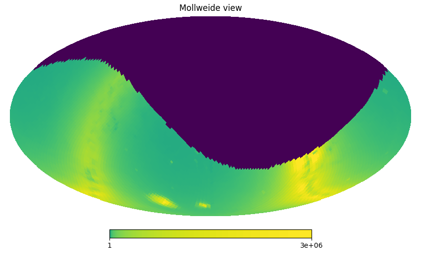
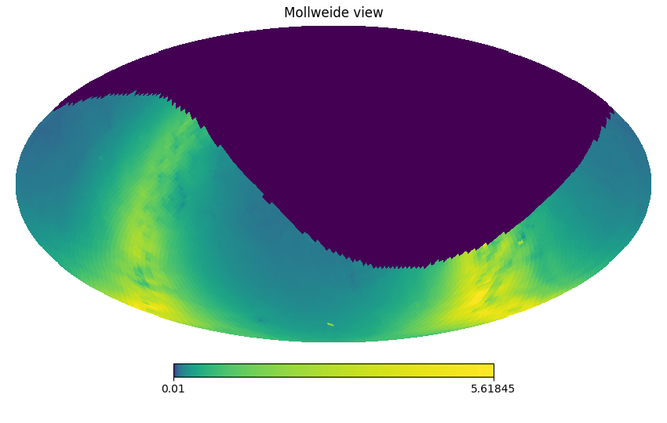
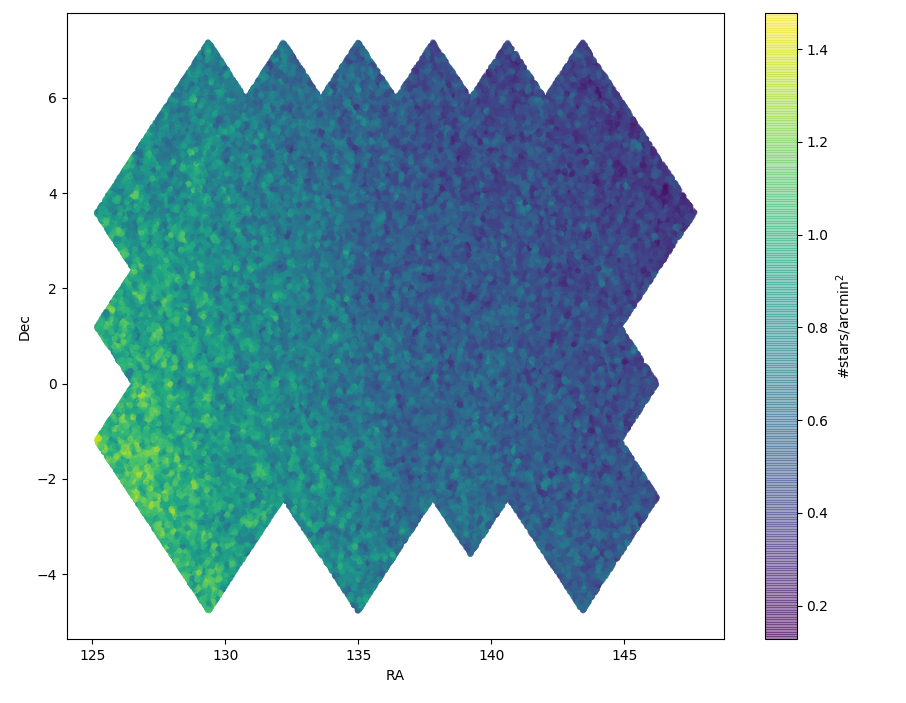
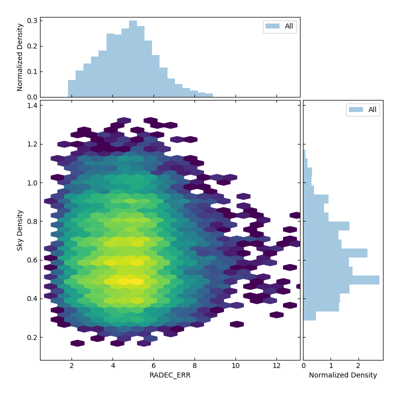

Data Description and Data Sets
===============================
    
    
Object Classes
----------------------

The following three classes exist
  
  0) Stars
  1) Others
  2) Random matches

Catalog Screening/Filtering
---------------------------

Query to obtain Gaia sources::

  SELECT * FROM gaiaedr3.gaia_source
  WHERE parallax_over_error >  3
  AND phot_g_mean_flux_over_error>10
  AND phot_rp_mean_flux_over_error>10
  AND phot_bp_mean_flux_over_error>10

 
eROSITA criteria::

  RADEC_ERR > 0 (NICHT RADEC_ERR_CORR)
  EXT_LIKE < 6

 
The eFEDS positional error is::

 sqrt((RADEC_ERR**2 + 0.7**2)/2)

Fluxes are:: 

  F_X = ML_RATE*10**(-12) erg/cm**2/s
  F_G = 10**(-0.4*Gmag)*4052.97*2.5e-910**(-12) erg/cm**2/s                   
  
See also (http://svo2.cab.inta-csic.es/theory/fps/index.php?mode=browse&gname=GAIA&gname2=GAIA3&asttype=)

Lastly, sources with X-ray luminosities above 2e31 erg/s are discarded from the training set.
  
The different data sets
------------------------

Names in brackets pertain to their corresponding name in the config-file (**idx** is the healpix index):
Names in square brackets give the identifier for `file4`.

  - eROSITA source list (*Sources:ero_filename*)[``ero_filename``]
      This file is provided by the catalog team and will not be changed
      
  - eROSITA source list with healpix indices (*Sources:ero_filename_hp*)[``ero_filename_hp``]
      
  - eROSITA tiles (*data_dir* / *prefix* _nside *nside* _ **idx**.fits)[``ero_tiles``]
      This file may be annotated, but shall always contain the full content. 
      
  - Gaia tiles (*data_dir*  / *prefix* _nside *nside* _**idx**.fits)[``gaia_tiles``]    
      This file may be annotated, but shall always contain the full content. 
      
  - For each tile, the following sets
      a) *major* [``major_tiles``]
      b) *random* [``random_tiles``]
      c) *training* [``training_tiles``]
      
      Plus the same data sets in the _small_ incarnation [``*_small``]
      
  - Finally, the merged data sets
      a) *major* [``major``]
      b) *random* [``random``]
      c) *training* [``training``]
      

Data Processing Steps
--------------------------------------------

The switch in the .ini-file is given as *[section][switch]*, column names 
as ``colname``.

1. Data preparation
    a. eROSITA data 
         - *[Healpix][calculate]*: :func:`~eroML.tile.pixelize.add_healpix_col` 
             Healpix index (``healpix``)
         - *[eROSITA preparation][perform]*: :func:`~eroML.tile.pixelize.generate_healpix_files`
             Split sources into healpix tiles
         - *[eROSITA preparation][enrich]*: :func:`~eroML.utils.enrich.enrich_eROSITA` 
             ``FX``, ``eligible_eROSITA``,  and the dummy columns ``pm_RA``, ``pm_Dec``, ``ref_epoch``
             
             This step also introduces a minimum positional uncertainty of 1 arcsec for the X-ray position.
             
    b. Gaia data
         - *[Gaia Download][perform]*: :func:`~eroML.utils.gaia_tools.download_Gaia_tiles`  and :func:`~eroML.utils.gaia_tools.download_one_Gaia_polytile`
           
             Download Gaia and store in individual tiles (takes a long time)
             
         - *[Enrich Gaia][perform]*:  :func:`~eroML.utils.enrich.enrich_Gaia`
             G-band flux (``Fg``), compatibility with isochrones (``iso_compatible``),
             the Gaia quality (``Gaia_quality``), if the source fullfills the Gaia quality
             criterium and is compatible with the isochrones (``eligible_Gaia``), and 
             the sky density of the eligible Gaia sources (``eligible_sky_density``)
         
             This step is required to work on the full data 
         
2. Generate data sets        
    a. *[Data sets][major]*: :func:`~eroML.utils.datasets.major_set`
        Perform the positional matching up the 3. nearest neighbour.
        
        Extra columns: ``offset_sig``, ``match_dist``
        
        Plus the columns from the eROSITA and Gaia files. 
    
    b. Random set
    c. Training set

3. (Position) Matching
    a. True eROSITA sources
    b. Random sources (N times)
    c. Enrich merged dataset(s)
    
4. Generate datasets
    a. Training
    b. Validation
    
5. Learn 

6. Match

Work Logic
-----------

Loop through Tiles 

  0. (method: :func:`~eroML.tile.tile.loop`)

  1. For each Tile: (method: :func:`~eroML.tile.tile.Tile.prepare_data`)
      a) Get Gaia sources
          - Get sky extent 
          - Download Gaia sources from archive
          - Convert Gaia data to fits-file
      b)  Prepare data (method: :func:
          - For Gaia, add columns: `Fg`, `iso_compatible`, `eligible`, `sky_density`, `sky_density_eligible`
          - For eROSITA, add columns: `Fx`       
          
  2. Generate data sets  (method: :func:`~eroML.tile.tile.Tile.generate_sets`)
      a) major set : Containing all matched sources (:func:`~eroML.utils.datasets.major_set`)
      b) random set : Shift all source by a random amount and match  (:func:`~eroML.utils.datasets.random_set`)
      c) training set : Best matching sources  (:func:`~eroML.utils.datasets.training_set`)
      d) training+random : training set plus random source fullfilling the same criteria as the training set sources (:func:`~eroML.utils.datasets.training_random_set`)
      
..   3. Merge tiles (method: :func:``)
   

Sky Density
------------

Global Sky Density
~~~~~~~~~~~~~~~~~~

The sky density can be displayed by running::
  
  p37 tools/sky_density.py
  p37 tools/calculated_sky_density.py
  
The number of stars per healpix shows the structure of the Milky Way

   
   Number of all Gaia stars per healpix
   
while the density of the eligible stars mostly but not completely mirrors the 
density of all stars. For example, large and small Magellanic Clouds represent
depressions in the density of the eligible sources.
  

   Mean density of eligible sources per healpix (:math:`\text{arcmin}^{-2}`)

eFEDS Sky Density
~~~~~~~~~~~~~~~~~

The calculated sky density in the eFEDS field is
  

   

   
