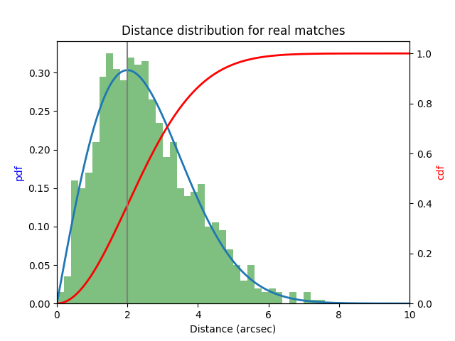

Classification
====================================

Relevant Properties
-------------------
The following properties are used to differentiate between real stellar associations and non-stellar sources or random matches.

1. Positional match
    The match distance is first transfered in sigma units and then log(1-cdf) is used
    
2. Gaia magnitude (or rather flux)
    In log-units (+11)

3. X-ray flux
    In log-units (+13)
    
4. Parallax
    In log(value)

5. Gaia color
    In mag
    
6. Local sky density of eligible counter parts
    As 1/(number of sources within 3 arcmin)
   
   
Distance-based Classification
------------------------------

Real matches
~~~~~~~~~~~~~~~~~~~~~~~
The (on-sky) distance between real sources is described by 

.. math::  
    
    \large pdf (x) = \frac{x}{\sigma^2} e^{\frac{-x^2}{2 \sigma^2}}
    
where :math:`\sigma` is the positional uncertainty in the X-ray position (the Gaia     
positional error is negligible in this context). Its integral, the cdf, is

.. math::

    \large 
    \begin{eqnarray}
        \int_0^y pdf(x) dx & = &
        \int_0^y \frac{x}{\sigma^2} e^{\frac{-x^2}{2 \sigma^2}} dx \\
             & = & \left[- e^{\frac{-  x^2}{2\sigma^2}}  \right]^y_0 \\
             & = & 1 -  e^{\frac{- y^2}{2\sigma^2 }}
    \end{eqnarray}         

so that 

.. math::

    \large 
    y = \sqrt{-2 \sigma^2 \ln(1-x)}
    

   
Random matches
~~~~~~~~~~~~~~
The nearest neighbour distribution of random sources is

.. math::

    \large pdf (x) = 2  \pi  x  \eta e^{- \pi \eta x^2}

with the sky density :math:`\eta`. Note that the peak of the distribution scales with :math:`\large \sqrt{\frac{1}{\eta}}`. 
The equation for random sources equals the equation for real match if

.. math::

    \large
    \sigma = \sqrt{\frac{1}{2 \pi \eta}}  
    

Therefore, we find the distribution to sample from as

.. math::

    \large 
    y = \sqrt{\frac{-\ln(1-x)}{\pi \phi} }

    

Real vs Random
~~~~~~~~~~~~~~

With a mean positional uncertainty of about 4 arcsec, the distributions of 
real and random sources equal each other for a density of *eligible* of 
  :math:`36 \text{arcmin}^2`.

    

   
Classes
----------------------

The following three classes exist
  
  0) Stars
  1) Others
  2) Random matches

