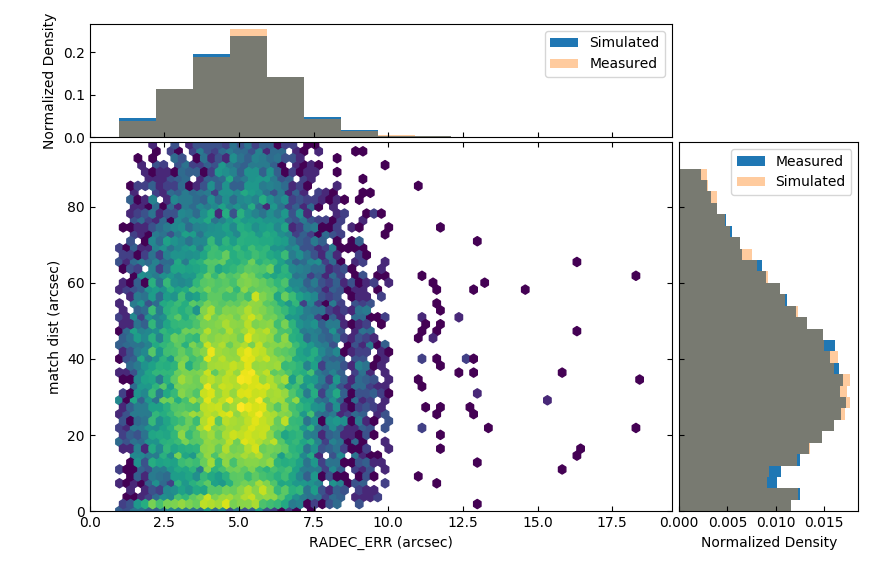

Classification
====================================

Relevant Properties
-------------------
The following properties are used to differentiate between real stellar associations and non-stellar sources or random matches.

1. Match Distance (in arcsec)
    
2. Positional uncertainty  (sigma not RADEC_ERR; in arcsec)
    
3. Gaia magnitude (or rather flux)
    In log-units (+11)

4. X-ray flux
    In log-units (+13)
    
5. Parallax
    In log(value)

6. Gaia color
    In mag
    
7. Local sky density of eligible counter parts
    As 1/(number of sources within 3 arcmin)
   
   
Distance-based Classification
------------------------------

The on-sky distance between eROSITA and Gaia sources plays a crucial role for 
the classification. Therefore, the properties of the matching distance are 
described below.

Real matches
~~~~~~~~~~~~~~~~~~~~~~~
The (on-sky) distance between real sources is described by 

.. math::  
    
    \large pdf (x) = \frac{x}{\sigma^2} e^{\frac{-x^2}{2 \sigma^2}}
    
where :math:`\sigma` is the positional uncertainty in the X-ray position (the Gaia     
positional error is negligible in this context). Its integral, the cdf, is

.. math::

    \large 
    \begin{eqnarray}
        \int_0^y pdf(x) dx & = &
        \int_0^y \frac{x}{\sigma^2} e^{\frac{-x^2}{2 \sigma^2}} dx \\
             & = & \left[- e^{\frac{-  x^2}{2\sigma^2}}  \right]^y_0 \\
             & = & 1 -  e^{\frac{- y^2}{2\sigma^2 }}
    \end{eqnarray}         

so that 

.. math::

    \large 
    y = \sqrt{-2 \sigma^2 \ln(1-x)}
    
.. image:: distances_real_sources.png
   :width: 70%
   :alt: Distances for real sources
   :align: center
   
Random matches
~~~~~~~~~~~~~~
The nearest neighbour distribution of random sources is

.. math::

    \large pdf (x) = 2  \pi  x  \eta e^{- \pi \eta x^2}

with the sky density :math:`\eta`. Note that the peak of the distribution scales with :math:`\large \sqrt{\frac{1}{\eta}}`. 
The equation for random sources equals the equation for real match if

.. math::

    \large
    \sigma = \sqrt{\frac{1}{2 \pi \eta}}  
    

Therefore, we find the distribution to sample from as

.. math::

    \large 
    y = \sqrt{\frac{-\ln(1-x)}{\pi \phi} }

    

Real vs Random
~~~~~~~~~~~~~~

With a mean positional uncertainty of about 4 arcsec, the distributions of 
real and random sources equal each other for a density of *eligible* of 
:math:`36 \text{arcmin}^2`.

Peak of the distribution
~~~~~~~~~~~~~~~~~~~~~~~~

The peak of the pdf is

.. math::

    \large
    \begin{eqnarray}
        \frac{d}{dx} pdf(x) & = & 0\\
        \frac{d}{dx} 2\alpha \cdot x \cdot e^{-\alpha \cdot x^2} & = & 0\\
        -2 \alpha \left( 2\alpha\cdot x^2 -1 \right) e^{-\alpha x^2} & = & 0\\
    \end{eqnarray}
    
where :math:`\large \alpha = \sigma^{-2}/2` for real matches and :math:`\large \alpha=\pi \eta` 
for random matches. Therefore, the peak is at 

.. math::

    \large
        x =  \sqrt{\frac{1}{2\alpha}}
        = \left\{ 
          \begin{array}{ll}
          \sigma ~~ \text{for real sources}\\
          \sqrt{\frac{1}{2\pi\eta}}  ~~ \text{for random sources}\\
          \end{array}
          \right.
    
    
Implementation
~~~~~~~~~~~~~~

In the folder::

  ...eroML/positions/
  
are scripts to perform a classification based on position only.

Specifically, run::

  p37 positions/simu4major.py 2060 --conf eFEDS_EDR3.ini --ofn offs2.dat -o --rnd_factor=14.6
  
in the `eroML` directory to generate 2060 real and the number of random sources corresponding to
the eFEDS stellar fraction (and write data to ``offs2.dat``).  

A simulation assuming uniform distributions in RADEC_ERR (sigma) and sky density can be created by
running the script::

  simu_uniform.py
  
  

The result of the simulation can be seen by invoking (in ``...eroML/positions/``)::

  p37 check_one_simu.py
  

  
The ratio between real and random sources is shown by (in ``...eroML/positions/``)::

  p37 density_ratio.py

    

  
